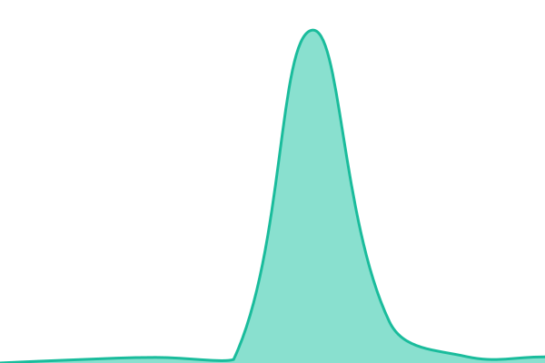
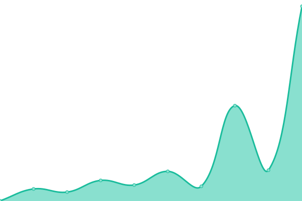
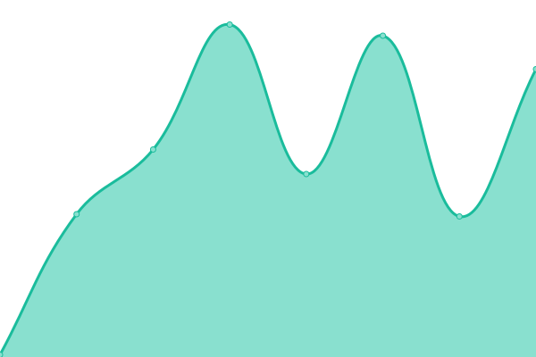
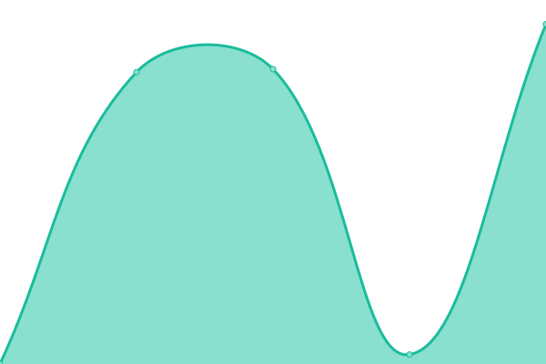
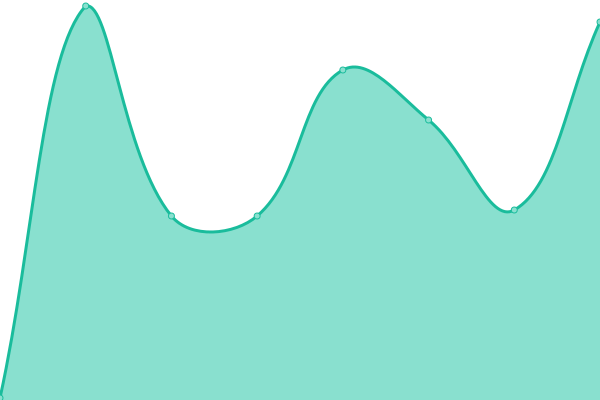
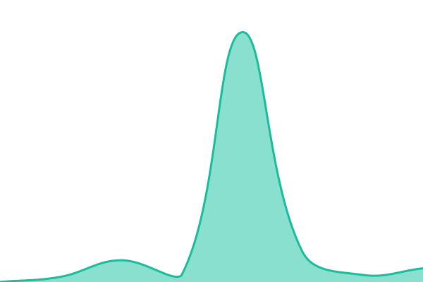
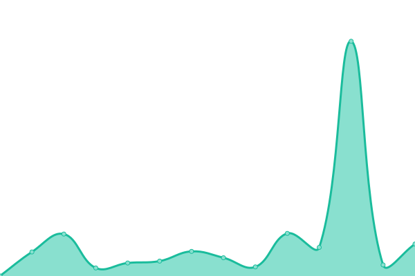

# [📈 Live Status](https://wwsquared.github.io/up): <!--live status--> **🟧 Partial outage**

This repository contains the open-source uptime monitor and status page for [wwsquared](https://wwsquared.github.io/up), powered by [Upptime](https://github.com/upptime/upptime).

With [Upptime](https://upptime.js.org), you can get your own unlimited and free uptime monitor and status page, powered entirely by a GitHub repository. We use [Issues](https://github.com/wwsquared/up/issues) as incident reports, [Actions](https://github.com/wwsquared/up/actions) as uptime monitors, and [Pages](https://wwsquared.github.io/up) for the status page.

<!--start: status pages-->
<!-- This summary is generated by Upptime (https://github.com/upptime/upptime) -->
<!-- Do not edit this manually, your changes will be overwritten -->
<!-- prettier-ignore -->
| URL | Status | History | Response Time | Uptime |
| --- | ------ | ------- | ------------- | ------ |
|  [WWUSA](https://wellnesswayusa.com) | 🟩 Up | [wwusa.yml](https://github.com/wwsqaured/up/commits/HEAD/history/wwusa.yml) | 

 309ms
     
 | 

<a href="https://wwsqaured.github.io/up/history/wwusa">100.00%</a>
    

|  [SRCBenefits](https://srcbenefits.com) | 🟥 Down | [src-benefits.yml](https://github.com/wwsqaured/up/commits/HEAD/history/src-benefits.yml) | 

 0ms
     
 | 

<a href="https://wwsqaured.github.io/up/history/src-benefits">0.00%</a>
    

|  [SRSO Benefits](https://srsobenefits.com) | 🟥 Down | [srso-benefits.yml](https://github.com/wwsqaured/up/commits/HEAD/history/srso-benefits.yml) | 

 0ms
     
 | 

<a href="https://wwsqaured.github.io/up/history/srso-benefits">0.00%</a>
    

|  [JO Insurance](https://joservicesinsurance.com) | 🟥 Down | [jo-insurance.yml](https://github.com/wwsqaured/up/commits/HEAD/history/jo-insurance.yml) | 

 0ms
     
 | 

<a href="https://wwsqaured.github.io/up/history/jo-insurance">0.00%</a>
    

|  [FirstResponder](https://firstrespondersflorida.com) | 🟥 Down | [first-responder.yml](https://github.com/wwsqaured/up/commits/HEAD/history/first-responder.yml) | 

 0ms
     
 | 

<a href="https://wwsqaured.github.io/up/history/first-responder">0.00%</a>
    

|  [WellnessWayUSA](https://wellnesswayusa.com) | 🟩 Up | [wellness-way-usa.yml](https://github.com/wwsqaured/up/commits/HEAD/history/wellness-way-usa.yml) | 

 590ms
     
 | 

<a href="https://wwsqaured.github.io/up/history/wellness-way-usa">100.00%</a>
    

|  [WW Connect](https://wellnesswayconnect.com) | 🟥 Down | [ww-connect.yml](https://github.com/wwsqaured/up/commits/HEAD/history/ww-connect.yml) | 

 0ms
     
 | 

<a href="https://wwsqaured.github.io/up/history/ww-connect">0.00%</a>
    

<!--end: status pages-->

[**Visit our status website →**](https://wwsquared.github.io/up)

## 📄 License

- Powered by: [Upptime](https://github.com/upptime/upptime)
- Code: [MIT](./LICENSE) © [wwsquared](https://wwsquared.github.io/up)
- Data in the `./history` directory: [Open Database License](https://opendatacommons.org/licenses/odbl/1-0/)
